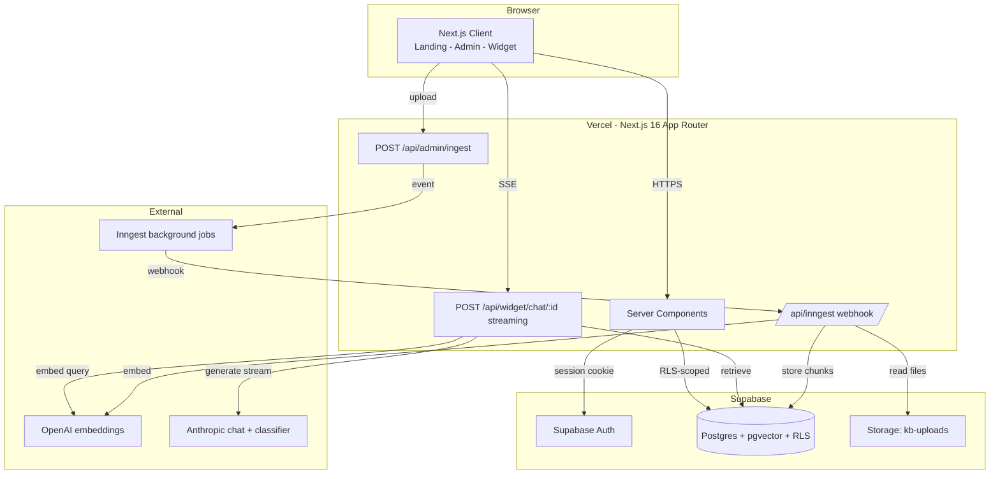

# AI Coach — Plug-and-Play Multi-Tenant RAG Platform

A SaaS template that gives every coach their own AI assistant: grounded in
their knowledge base, shaped by their persona, and shareable with their
clients through a public chat widget — no signup required for the clients.

Two coaches ship pre-seeded so you can see multi-tenant RAG working out of
the box.

## Live Demo

🌐 **Live URL:** **https://ai-role-project.vercel.app**

| Workspace | Domain | Email | Password |
|---|---|---|---|
| StrengthLab — Coach Marcus | Training | `coach.marcus@strengthlab.demo` | `Demo1234!` |
| FuelRight — Nina | Nutrition | `coach.nina@fuelright.demo` | `Demo1234!` |

The landing page is a public directory: browse by domain → pick a coach →
chat as a client (no login). To see the coach side, log in with either
account above. The two knowledge bases are completely separate — same
question to Marcus vs. Nina returns different, separately-cited answers.

## Quickstart

```bash
git clone https://github.com/bendagan85/AI-Role-Project.git && cd AI-Role-Project
cp .env.example .env.local        # fill in Supabase + OpenAI + Anthropic keys
pnpm install
# apply supabase/migrations/0001..0007 in the Supabase SQL editor (see below)
pnpm seed                          # creates the 2 demo coaches + ingests 20 docs
pnpm dev                           # http://localhost:3000
# in a second terminal, for document uploads:
npx inngest-cli@latest dev
```

## What This Is

Three connected pieces in one Next.js app:

1. **RAG agent** — answers grounded in a tenant's KB, with inline citations,
   makes recommendations, and refuses out-of-scope questions instead of
   hallucinating.
2. **Public chat widget** — `/widget/[tenantId]`, no auth, embeddable via
   iframe, per-device conversation history with a sidebar.
3. **Admin panel** — `/admin/*`, where a coach uploads/links/pastes sources,
   re-indexes, configures persona/prompt/model/temperature/retrieval-k, and
   gets their shareable widget URL.

Login is required for coaches; each coach is a fully isolated tenant.

## Architecture



One Next.js app, one Postgres (pgvector for embeddings + RLS for isolation),
Inngest for ingestion that would otherwise time out on serverless.

## The Knowledge Bases

Fitness and performance nutrition. Chosen deliberately:

- **Recommendations matter as much as facts** — "what should I do next?",
  "where do I start?" are natural here, exercising the recommendation
  requirement, not just Q&A.
- **Exact-term retrieval** — `5x5`, `RPE 8`, `TDEE`, `g/kg` are tokens pure
  semantic search misses. This domain showcases why hybrid search matters.
- **A relatable demo** — anyone can judge whether "how do I fix knee cave?"
  got a good, sourced answer; and Marcus vs. Nina makes isolation visible
  (both KBs touch pre-workout nutrition from different angles).

20 curated markdown docs total (10 per coach in `seed-data/`), enough to
surface real retrieval behaviour rather than a toy demo.

## Tech Stack — Choices and Why

- **Next.js 16 (App Router) + TypeScript strict** — one full-stack app; Route
  Handlers for the API; Server Components by default. (Spec said 15; latest
  stable is 16 — same App Router, Turbopack default.)
- **Supabase (Postgres + Auth + Storage)** — one DB, one auth model. RLS
  policies apply to embeddings natively, so vector isolation is free.
- **pgvector (HNSW, cosine)** — no separate vector DB to run, secure, and
  production-grade at this scale. A dedicated vector DB only wins at 10M+.
- **Hybrid search (pgvector + Postgres FTS, fused with RRF)** — semantic
  alone misses exact tokens; keyword alone misses concepts; RRF combines them
  with no score calibration.
- **OpenAI `text-embedding-3-small`** — 1536-dim, cheap, strong.
- **Anthropic Claude Sonnet 4.6** (chat, tenant-selectable) and
  **Claude Haiku 4.5** (the coach-category classifier) via the Vercel AI SDK
  — provider-agnostic streaming with `useChat`.
- **Inngest** — ingestion is a durable background job so a 50-page PDF
  doesn't hit Vercel's serverless timeout. One function, retries included.
- **Tailwind v4 + shadcn/ui** — current standard; v4 is CSS-config only
  (no `tailwind.config.ts`).
- **pnpm 10** — pinned (corepack's bundled pnpm 11 has a Node 20 bug).

## How RAG Works Here

1. **Ingest** — file/URL/text → extract (pdf-parse / mammoth / Readability)
   → chunk (~800 tokens, 150 overlap) → batch-embed → store in `chunks`.
   Runs as an Inngest job; idempotent (re-ingest deletes old chunks first).
2. **Retrieve** — embed the query, run semantic + keyword search (each top-25),
   fuse with Reciprocal Rank Fusion, return top-k (tenant-scoped). Below a
   0.3 cosine threshold the prompt is told retrieval was weak.
3. **Generate** — system prompt = persona + the coach's custom prompt +
   hard grounding rules (cite by title, don't invent, reply in the user's
   language, brief small-talk) + retrieved context. Streamed from Claude;
   citations are derived from retrieval, not the model.

## Multi-Tenant Isolation

Three layers (`docs/SPEC.md` §8):

1. **Database — RLS.** Every table has a policy `tenant_id = auth.uid()`.
   Postgres refuses cross-tenant reads even if app code has a bug.
2. **Repository.** Every data-access function takes `tenantId` and adds an
   explicit `.eq('tenant_id', tenantId)` anyway. Belt and suspenders.
3. **Session-derived tenantId.** Never trusted from the client — always the
   authenticated session's `user.id` on the server.

Proven by an **automated, self-contained test**: `pnpm test` provisions two
throwaway users, gives each private data, and asserts neither can read the
other's chunks/documents/tenant row (and that an anonymous client reads
nothing). 6 cases, green, torn down after.

## Deliberate Product Decisions (beyond the spec)

- **Two clear audiences.** Coaches log in → `/admin`. Clients use the public
  `/widget/[id]` with no account, like Intercom/Crisp/Calendly. The landing
  is a minimalist directory grouped by domain.
- **AI category classifier.** On every persona/prompt save (and at seed),
  Claude Haiku classifies the coach into Training / Nutrition / Other; the
  agent page shows the result and warns if a vague persona won't be listed.
- **Widget conversation history.** Per-device, per-coach, localStorage-backed
  with a sidebar (new / switch / delete) — no client account needed.
- **Ephemeral test chat.** `/app` is a scratchpad for the coach to verify
  tone/grounding; it never persists, starts fresh each visit.

## What I Chose Not To Build

Cohere reranking, LLM observability (Helicone/Langfuse), external rate
limiting (Upstash), a JavaScript embed launcher, trainee accounts. Each is a
known production add-on; at this scale they add API keys, latency, and
failure modes for marginal demo value. Shipping a tight, fully-working core
is the stronger signal. (Widget rate-limiting is a simple in-memory throttle.)

## What I'd Do Next

- Cohere/Voyage reranking on top of hybrid retrieval (precision at top-k).
- Multi-turn query rewriting for follow-ups; conversation-summary memory.
- Optional trainee accounts so widget history syncs across devices.
- Per-document permissions inside a tenant; LLM observability.
- Streaming citation surfacing as chunks are retrieved.

## Local Development

### Hosted Supabase (recommended)

1. Create a Supabase project. Copy URL + anon + service_role into `.env.local`.
2. In the SQL Editor, run `supabase/migrations/0001` → `0007` in order.
3. Authentication → disable "Confirm email" (or rely on the dev
   auto-confirm trigger in `0004`).
4. `pnpm install && pnpm seed && pnpm dev`. Second terminal:
   `npx inngest-cli@latest dev` (only needed to upload new docs).

### Fully local with Docker

`docker compose up` boots Postgres+pgvector (migrations auto-applied) and the
Inngest dev server. Auth/Storage still use a hosted Supabase project — the
full Supabase stack locally is intentionally out of scope.

## Project Structure

```
src/app/            routes: (auth) - admin - app - coaches - widget - api
src/components/      chat/ - admin/ - auth/ - ui (shadcn)
src/lib/             rag/ (chunk-embed-retrieve-prompts-classify) -
                     repositories/ - supabase/ - inngest/ - categories
supabase/migrations/ 0001..0007 (tables - RLS - triggers - storage - category)
seed-data/           strengthlab/ - fuelright/  (10 markdown docs each)
scripts/             seed.ts - eval.ts        tests/ isolation.test.ts
evals/golden.ts      docs/ SPEC - DESIGN - CONVERSATION_CONTEXT - PROGRESS
```

## Trade-offs & Known Issues

- Migrations are applied manually in the Supabase SQL Editor (no CLI step
  required to evaluate).
- Production document upload requires Inngest Cloud env vars
  (`INNGEST_EVENT_KEY`, `INNGEST_SIGNING_KEY`); the demo coaches are
  pre-seeded via inline ingestion so the live app is fully usable regardless.
- Widget history is per-device (localStorage), by design.
- Built on Windows + WSL2; all commands run inside WSL.

## Verify it works

```bash
pnpm typecheck      # strict, clean
pnpm test           # cross-tenant isolation — 6 cases
pnpm eval           # golden questions — grounded answers + refusals
pnpm build          # production build
```

## License & Attribution

MIT. All seed content was written for this project — see
`seed-data/SOURCES.md`. Not medical advice; the nutrition agent includes a
disclaimer in its system prompt.
